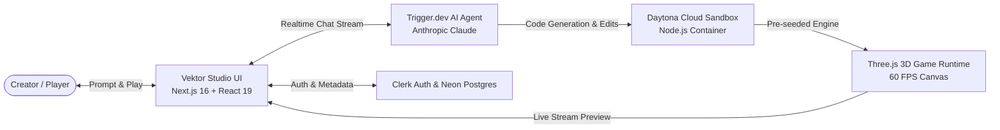

# Vektor Studio

> **Prompt in words. Play in dimensions.**

Vektor Studio is an agentic, AI-native 3D game creation platform. Describe any game concept in plain English—from voxel survival islands and samurai parry duels to third-person comic shooters—and watch an autonomous AI developer plan, build, and deploy a live, interactive 3D game in seconds.

---

## ✨ Features

- **🧠 Agentic Game Developer**: Powered by Anthropic Claude via Trigger.dev's realtime agent runtime. The agent writes clean Three.js code, handles delta-timed update loops, connects user inputs, and debugs runtime errors autonomously.
- **⚡ Daytona Cloud Sandboxes**: Each game is provisioned into an isolated, ephemeral cloud development container via the `@daytona/sdk`. The sandbox seeds the game runtime, manages file trees, and serves secure preview endpoints.
- **🎮 Built-in 3D Game Engine**: Pre-seeded Three.js engine toolkit (`lib/games/runtime/engine`) with first-class primitives for:
  - Dynamic lighting (sunsets, neon city, studio lights)
  - Voxel terrain & procedural landscapes
  - Camera control (first-person, third-person, top-down, side-scroller)
  - Keyboard/mouse input bindings & action mappings
  - Audio synthesis & sound effects
  - HUD overlay rendering & tweening
- **🖥️ Split-Pane Studio Workspace**: Fluid, resizable dual-pane interface with conversational prompt iteration on the left and a live 60 FPS playable canvas preview on the right.
- **💳 Credit Ledger & Billing**: Integrated usage accounting with token/turn spending tracking and organization-level balance controls.
- **🔒 Production-Grade Foundation**: Powered by Clerk for secure authentication, Neon Serverless Postgres with Drizzle ORM, and Sentry for end-to-end tracing.

---

## 🏗️ Architecture



---

## 🛠️ Tech Stack

| Layer | Technology |
| :--- | :--- |
| **Framework** | [Next.js 16 (App Router)](https://nextjs.org/) + [React 19](https://react.dev/) |
| **Styling & UI** | [Tailwind CSS v4](https://tailwindcss.com/) + [shadcn/ui](https://ui.shadcn.com/) + Base UI |
| **AI Orchestration** | [Trigger.dev Realtime Agent](https://trigger.dev/) + [Vercel AI SDK](https://sdk.vercel.ai/) + Anthropic Claude |
| **Sandbox Runtime** | [Daytona SDK](https://www.daytona.io/) |
| **3D Rendering** | [Three.js](https://threejs.org/) |
| **Database & ORM** | [Neon Serverless Postgres](https://neon.tech/) + [Drizzle ORM](https://orm.drizzle.team/) |
| **Authentication** | [Clerk](https://clerk.com/) |
| **Observability** | [Sentry](https://sentry.io/) |

---

## 🚀 Getting Started

### Prerequisites

Ensure you have the following installed and set up:
- **Node.js**: v20 or higher
- **Package Manager**: `pnpm` (recommended) or `npm`
- **Accounts & API Keys**:
  - [Daytona](https://www.daytona.io/) API Key & Target
  - [Trigger.dev](https://trigger.dev/) Account & Project
  - [Clerk](https://clerk.com/) Application Keys
  - [Neon Postgres](https://neon.tech/) Database Connection String
  - **LLM Providers (configure whichever you want to use)**:
    - [Anthropic](https://console.anthropic.com/) API Key (`ANTHROPIC_API_KEY`)
    - [OpenAI](https://platform.openai.com/) API Key (`OPENAI_API_KEY`)
    - [Google AI Studio](https://aistudio.google.com/) API Key (`GOOGLE_GENERATIVE_AI_API_KEY`)
    - [OpenCode Zen](https://opencode.ai/) API Key & Base URL (`OPENCODE_ZEN_API_KEY`, `OPENCODE_ZEN_BASE_URL`)

---

### Installation

1. **Clone the repository:**
   ```bash
   git clone https://github.com/code-with-antonio/sandbox.git vektor-studio
   cd vektor-studio
   ```

2. **Install dependencies:**
   ```bash
   pnpm install
   ```

3. **Configure Environment Variables:**
   Create a `.env.local` file in the root directory and supply your credentials:
   ```env
   # Clerk Auth
   NEXT_PUBLIC_CLERK_PUBLISHABLE_KEY=pk_test_...
   CLERK_SECRET_KEY=sk_test_...
   NEXT_PUBLIC_CLERK_SIGN_IN_URL=/sign-in
   NEXT_PUBLIC_CLERK_SIGN_UP_URL=/sign-up

   # Daytona Sandboxes
   DAYTONA_API_KEY=...
   DAYTONA_SERVER_URL=https://app.daytona.io/api
   DAYTONA_TARGET=...

   # AI & Trigger.dev
   TRIGGER_SECRET_KEY=tr_dev_...

   # LLM Providers (Supply API keys for models you wish to use)
   ANTHROPIC_API_KEY=sk-ant-...
   OPENAI_API_KEY=sk-proj-...
   GOOGLE_GENERATIVE_AI_API_KEY=...
   OPENCODE_ZEN_API_KEY=...
   # OPENCODE_ZEN_BASE_URL=https://zen.opencode.ai/v1 (optional, defaults to https://zen.opencode.ai/v1)
   # OPENCODE_ZEN_MODEL=claude-3-7-sonnet (optional override)
   # OPENCODE_ZEN_FAST_MODEL=gpt-4o-mini (optional override)

   # Neon Database (Drizzle ORM)
   DATABASE_URL=postgres://...
   DATABASE_URL_UNPOOLED=postgres://...

   # Observability (Optional)
   NEXT_PUBLIC_SENTRY_DSN=...
   SENTRY_DSN=...
   ```

4. **Initialize the Database:**
   Push the Drizzle schema directly to Neon:
   ```bash
   pnpm run db:push
   ```

5. **Start Development Servers:**
   Run the Next.js dev server alongside the Trigger.dev background worker:
   ```bash
   # Terminal 1: Next.js Web App
   pnpm run dev

   # Terminal 2: Trigger.dev Agent Worker
   pnpm run trigger:dev
   ```

6. Open [http://localhost:3000](http://localhost:3000) to start building games with **Vektor Studio**.

---

## 📂 Project Structure

```text
├── app/                  # Next.js App Router (pages, layouts, API routes)
│   ├── (app)/            # Authenticated application workspace & games view
│   ├── api/              # Preview and game lifecycle routes
│   └── layout.tsx        # Root layout, metadata & fonts
├── components/           # React UI components & studio interfaces
│   ├── app-sidebar.tsx   # Studio navigation & history
│   ├── chat-preview.tsx  # Daytona 3D iframe game runner & health monitor
│   ├── chat-thread.tsx   # Conversational prompt stream & turn controls
│   ├── game-chat.tsx     # Resizable dual-pane studio workspace
│   └── ui/               # shadcn / Base UI design system components
├── lib/
│   ├── billing/          # Credit ledger, turns accounting, & reconciliation
│   ├── daytona/          # Daytona SDK client & sandbox lifecycle hooks
│   ├── db/               # Drizzle ORM schema & Neon client
│   └── games/            # Engine prompt instructions, models catalog, & seed runtime
│       └── runtime/      # Pre-packaged Three.js 3D game engine seeded into sandboxes
├── trigger/              # Trigger.dev background tasks & realtime AI agent logic
└── drizzle.config.ts     # Drizzle Kit database configuration
```

---

## 📜 Scripts

| Command | Action |
| :--- | :--- |
| `pnpm dev` | Starts the Next.js local development server |
| `pnpm build` | Compiles the production bundle |
| `pnpm start` | Launches the production server |
| `pnpm trigger:dev` | Runs the local Trigger.dev worker for AI agents |
| `pnpm db:push` | Pushes Drizzle schema changes directly to Neon |
| `pnpm db:studio` | Launches Drizzle Studio GUI for inspecting database rows |
| `pnpm typecheck` | Runs TypeScript validation |
| `pnpm format` | Formats all code with Prettier and Tailwind plugin |

---

## 📄 License

MIT License. Designed and developed with [Next.js](https://nextjs.org/) and [Daytona](https://www.daytona.io/).
